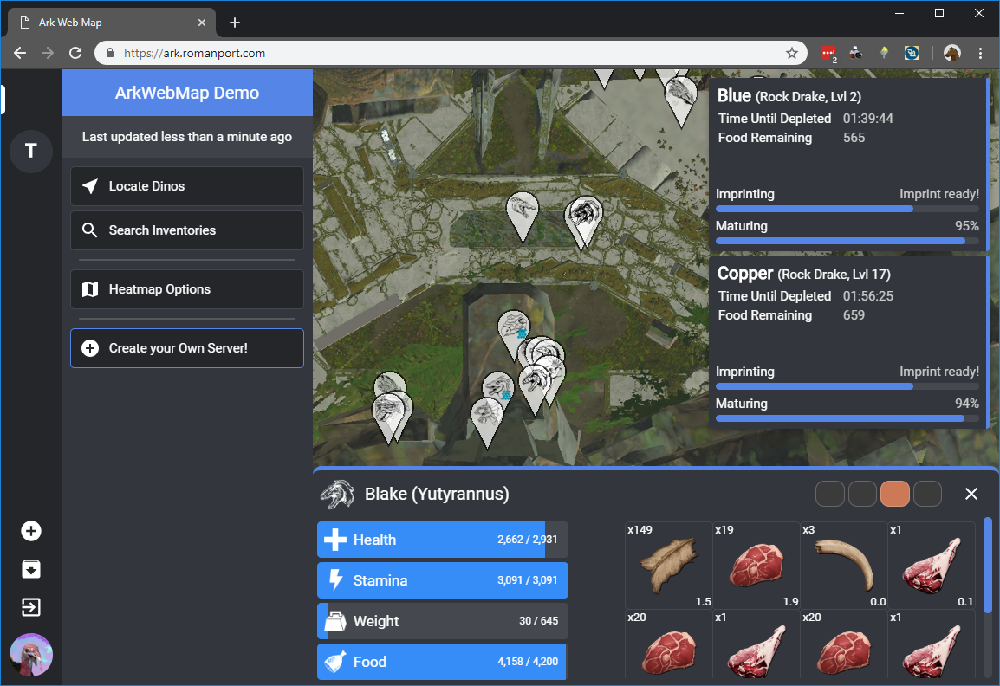
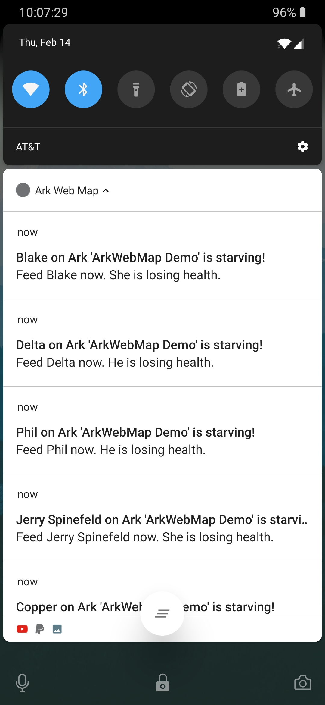

# Ark Web Map
A live map for Ark: Survival Evolved to view your tames, heatmap of wild dinos, and search tools. 

## Features
* View your tamed dinos
* View a heatmap of wild and tribe dinos
* Searcn the inventories of your tames
* View baby stats with time estimates for things like food
* A WIP Android client at https://github.com/Roman-Port/ArkWebMap-Android. Sorry folks, no iOS support anytime soon.
* Android notifications! 

## Planned Features
* Ability to search for tribe dinos

## Contributions
I'm not an expert in Git, so I don't know if you can right now. If you're willing to help me out, but cannot, send me a message.

## Setup
* To set up your own Ark Web Map, you'll need to clone this repo and grab my [Ark Save Manager](https://github.com/Roman-Port/Ark-Save-Manager) project, as it is required to use this map. 
* Next, you'll need to obtain your own map images __until I get permission to redistribute map images from allgamemaps.com__.
* A configuration file is coming soon. Instructions will be updated once that change comes aroud.